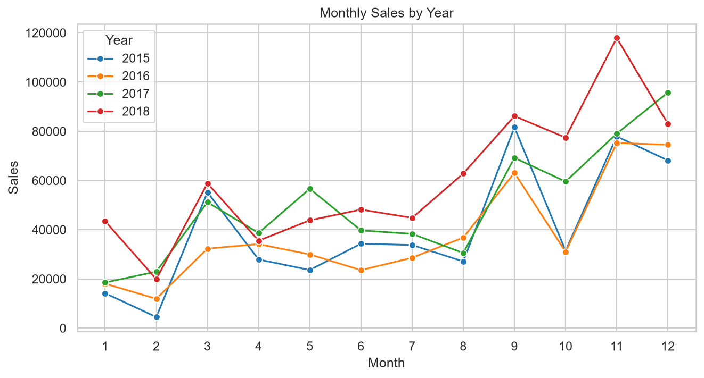
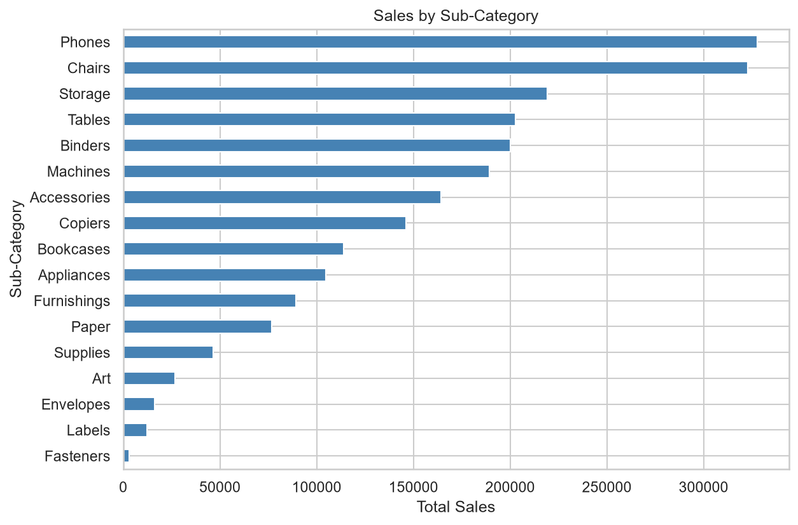
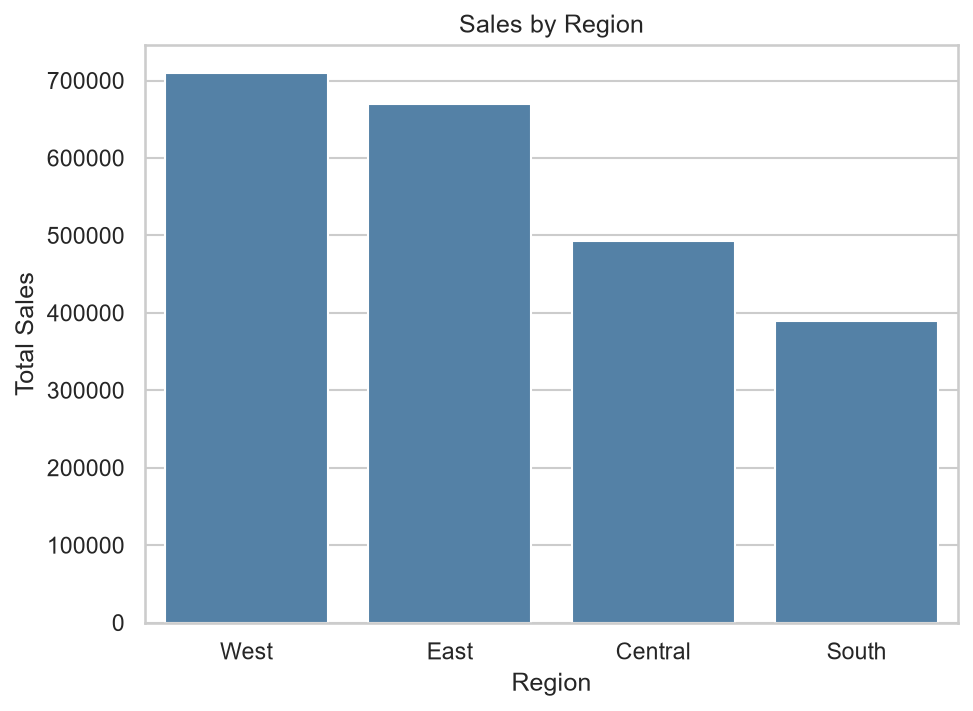

# Superstore Sales Analysis

Exploratory analysis of retail sales data (9,800 order lines, 2015-2018) using Python, to understand sales trends, seasonality, and regional and category performance.

## Business Questions
- How have sales changed over time?
- Which months drive the most sales?
- Which categories and regions perform best?

## Tools
Python, pandas, matplotlib, seaborn, Jupyter Notebook

## Key Findings
1. **Strong growth:** Sales rose from about $480K in 2015 to about $722K in 2018 (+50%), after a 4.3% dip in 2016. Growth was fastest in 2017 (+30.6%).
2. **Seasonality:** September, November, and December are the top three months every year and bring in about 43% of annual sales. February is the weakest.
3. **Category mix:** Technology leads with about 37% of sales, but Furniture (32%) and Office Supplies (31%) are close behind.
4. **Regional gap:** West (31%) and East (30%) generate over 60% of sales. South is weakest at 17%, less than half of West.

## Recommendations
- Scale inventory and promotions ahead of September and the November-December peak.
- Investigate why the South underperforms and set a target to close part of the gap.
- Study what drove the 2017-2018 growth and repeat it.

Note: the dataset has no profit column, so "top" means highest revenue, not highest profitability.

## Charts

## Project Structure
- `data/`: raw and cleaned datasets
- `notebooks/`: `01_data_cleaning.ipynb` (cleaning) and `02_eda.ipynb` (analysis)
- `images/`: saved charts

## How to Run
Install the dependencies with `pip install -r requirements.txt`, then run the notebooks in order.

## Dataset
Superstore Sales dataset from Kaggle.

## Power BI Dashboard
An interactive two-page dashboard built on the cleaned dataset.

**Overview:** KPI cards, filters for year, category and region, monthly sales trends, and sales by region and category.

**Details:** top 10 customers (about 6.8% of total sales) and sales by sub-category.

The file is in `dashboard/superstore_dashboard.pbix` (open with Power BI Desktop).